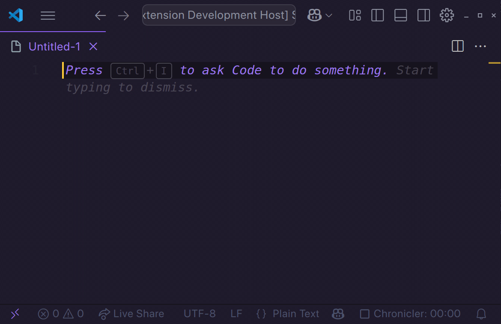

# Unicode shortcuts

Quickly insert Unicode symbols using simple LaTeX-like shortcuts. 

## Features

This extension allows you to insert Unicode characters in your documents using LaTeX-like shortcuts, such as `\pi`.

## How to use

Type the shortcut of the character you want to insert and press <kbd>Shift</kbd> + <kbd>Space</kbd>.

## Adding shortcuts

To add additional shortcuts:

1. Open the command pallet (<kbd>Ctrl</kbd> + <kbd>Shift</kbd> + <kbd>P</kbd>);
2. Type `Preferences: Open Settings (UI)`;
3. In the search bar, type `extension.unicode-shortcuts.shortcuts`;
4. Click `Edit in settings.json`;
5. Add a new shortcut to the dictionary.

## Available shortcuts

The following shortcuts are available by default.

### Logic symbols

| Command                          | Symbol |
|---------------------------------- |--------|
| `\not`, `\neg`                    | ¬      |
| `\forall`, `\ForAll`              | ∀      |
| `\exists`, `\Exists`              | ∃      |
| `\nexists`                        | ∄      |
| `\and`, `\land`, `\wedge`         | ∧      |
| `\or`                             | ∨      |
| `\vdash`                          | ⊢      |
| `\dashv`                          | ⊣      |
| `\top`                            | ⊤      |
| `\bot`, `\bottom`                 | ⊥      |
| `\bigwedge`                       | ⋀      |
| `\bigvee`                         | ⋁      |

### Greek letters

| Command                        | Symbol |
|-------------------------------- |--------|
| `\alpha`                        | α      |
| `\beta`                         | β      |
| `\gamma`                        | γ      |
| `\delta`                        | δ      |
| `\epsilon`                      | ε      |
| `\backepsilon`                  | ϵ      |
| `\zeta`                         | ζ      |
| `\eta`                          | η      |
| `\theta`                        | θ      |
| `\iota`                         | ι      |
| `\kappa`                        | κ      |
| `\lambda`                       | λ      |
| `\mu`                           | μ      |
| `\nu`                           | ν      |
| `\xi`                           | ξ      |
| `\omicron`                      | ο      |
| `\pi`                           | π      |
| `\rho`                          | ρ      |
| `\sigma`                        | σ      |
| `\tau`                          | τ      |
| `\upsilon`                      | υ      |
| `\phi`                          | φ      |
| `\chi`                          | χ      |
| `\psi`                          | ψ      |
| `\omega`                        | ω      |
| `\Gamma`                        | Γ      |
| `\Delta`                        | Δ      |
| `\Theta`                        | Θ      |
| `\Lambda`                       | Λ      |
| `\Xi`                           | Ξ      |
| `\Pi`                           | Π      |
| `\Sigma`                        | Σ      |
| `\Upsilon`                      | Υ      |
| `\Phi`                          | Φ      |
| `\Psi`                          | Ψ      |
| `\Omega`                        | Ω      |

### Equivalence relations

| Command           | Symbol |
|-------------------|--------|
| `\bsim`           | ∽      |
| `\nsim`           | ≁      |
| `\nvsim`          | ≁̸     |
| `\eqsim`          | ≂      |
| `\nesim`          | ≂̸     |
| `\simeq`          | ≃      |
| `\nsimeq`         | ≄      |
| `\cong`           | ≅      |
| `\ncong`          | ≇      |
| `\approx`         | ≈      |
| `\napprox`        | ≉      |
| `\approxeq`       | ≊      |
| `\approxident`    | ≋      |
| `\bcong`          | ≌      |
| `\asympeq`        | ≍      |
| `\bump`           | ≎      |
| `\nbump`          | ≎̸     |
| `\bumpeq`         | ≏      |
| `\nbumpeq`        | ≏̸     |
| `\doteq`          | ≐      |
| `\doteqdot`       | ≑      |
| `\triangleq`      | ≜      |
| `\eqcirc`         | ≖      |
| `\circeq`         | ≗      |
| `\neq`            | ≠      |
| `\ne`             | ≠      |
| `\equiv`          | ≡      |
| `\nequiv`         | ≢      |
| `\Equiv`          | ≣      |

### Order relations

| Command             | Symbol |
|---------------------|--------|
| `\leq`, `\le`       | ≤      |
| `\geq`, `\ge`       | ≥      |
| `\leqq`             | ≦      |
| `\geqq`             | ≧      |
| `\lneqq`            | ≨      |
| `\gneqq`            | ≩      |
| `\ll`               | ≪      |
| `\gg`               | ≫      |
| `\prec`             | ≺      |
| `\succ`             | ≻      |
| `\preccurlyeq`, `\preceq`      | ≼      |
| `\succcurlyeq`, `\succeq`      | ≽      |
| `\precsim`          | ≾      |
| `\succsim`          | ≿      |
| `\nprec`            | ⊀      |
| `\nsucc`            | ⊁      |

### Set theory

| Command              | Symbol |
|----------------------|--------|
| `\emptyset`, `\empty` | ∅      |
| `\in`                | ∈      |
| `\notin`             | ∉      |
| `\ni`                | ∋      |
| `\notni`             | ∌      |
| `\coprod`            | ∐      |
| `\cap`               | ∩      |
| `\cup`               | ∪      |
| `\uplus`             | ⊎      |
| `\between`           | ≬      |
| `\subset`            | ⊂      |
| `\supset`            | ⊃      |
| `\nsubset`           | ⊄      |
| `\nsupset`           | ⊅      |
| `\subseteq`          | ⊆      |
| `\supseteq`          | ⊇      |
| `\nsubseteq`         | ⊈      |
| `\nsupseteq`         | ⊉      |
| `\subsetneq`         | ⊊      |
| `\supsetneq`         | ⊋      |
| `\nsubsetneq`        | ⊈      |
| `\nsupsetneq`        | ⊉      |
| `\sqsubset`          | ⊏      |
| `\sqsupset`          | ⊐      |
| `\sqsubseteq`        | ⊑      |
| `\sqsupseteq`        | ⊒      |
| `\sqcap`             | ⊓      |
| `\sqcup`             | ⊔      |
| `\bigcap`            | ⋂      |
| `\bigcup`            | ⋃      |

### Fractions

| Command              | Symbol |
|----------------------|--------|
| `\frac`              | ⁄      |
| `\frac1`             | ⅟      |
| `\frac12`            | ½      |
| `\frac13`            | ⅓      |
| `\frac14`            | ¼      |
| `\frac15`            | ⅕      |
| `\frac16`            | ⅙      |
| `\frac17`            | ⅐      |
| `\frac18`            | ⅛      |
| `\frac19`            | ⅑      |
| `\frac10`            | ⅒      |
| `\frac23`            | ⅔      |
| `\frac25`            | ⅖      |
| `\frac35`            | ⅗      |
| `\frac45`            | ⅘      |
| `\frac56`            | ⅚      |
| `\frac34`            | ¾      |
| `\frac38`            | ⅜      |
| `\frac58`            | ⅝      |
| `\frac78`            | ⅞      |
| `\frac03`            | ↉      |
| `\promille`, `\permille`, `\perthousand` | ‰      |
| `\pertenthousand`, `\basispoint` | ‱      |

### Sub- and superscripts

| Command              | Symbol |
|----------------------|--------|
| `\supA`              | ᴬ     |
| `\supB`              | ᴮ     |
| `\supC`              | ꟲ     |
| `\supD`              | ᴰ     |
| `\supE`              | ᴱ     |
| `\supF`              | ꟳ     |
| `\supG`              | ᴳ     |
| `\supH`              | ᴴ     |
| `\supI`              | ᴵ     |
| `\supJ`              | ᴶ     |
| `\supK`              | ᴷ     |
| `\supL`              | ᴸ     |
| `\supM`              | ᴹ     |
| `\supN`              | ᴺ     |
| `\supO`              | ᴼ     |
| `\supP`              | ᴾ     |
| `\supQ`              | ꟴ     |
| `\supR`              | ᴿ     |
| `\supT`              | ᵀ     |
| `\supU`              | ᵁ     |
| `\supV`              | ⱽ     |
| `\supW`              | ᵂ     |
| `\supa`              | ᵃ     |
| `\supb`              | ᵇ     |
| `\supc`              | ᶜ     |
| `\supd`              | ᵈ     |
| `\supe`              | ᵉ     |
| `\supf`              | ᶠ     |
| `\supg`              | ᵍ     |
| `\suph`              | ʰ     |
| `\supi`              | ⁱ     |
| `\supj`              | ʲ     |
| `\supk`              | ᵏ     |
| `\supl`              | ˡ     |
| `\supm`              | ᵐ     |
| `\supn`              | ⁿ     |
| `\supo`              | ᵒ     |
| `\supp`              | ᵖ     |
| `\supq`              | 𐞥    |
| `\supr`              | ʳ     |
| `\sups`              | ˢ     |
| `\supt`              | ᵗ     |
| `\supu`              | ᵘ     |
| `\supv`              | ᵛ     |
| `\supw`              | ʷ     |
| `\supx`              | ˣ     |
| `\supy`              | ʸ     |
| `\supz`              | ᶻ     |
| `\sup0`              | ⁰     |
| `\sup1`              | ¹     |
| `\sup2`              | ²     |
| `\sup3`              | ³     |
| `\sup4`              | ⁴     |
| `\sup5`              | ⁵     |
| `\sup6`              | ⁶     |
| `\sup7`              | ⁷     |
| `\sup8`              | ⁸     |
| `\sup9`              | ⁹     |
| `\suba`              | ₐ     |
| `\sube`              | ₑ     |
| `\subh`              | ₕ     |
| `\subi`              | ᵢ     |
| `\subj`              | ⱼ     |
| `\subk`              | ₖ     |
| `\subl`              | ₗ     |
| `\subm`              | ₘ     |
| `\subn`              | ₙ     |
| `\subo`              | ₒ     |
| `\subp`              | ₚ     |
| `\subr`              | ᵣ     |
| `\subs`              | ₛ     |
| `\subt`              | ₜ     |
| `\subu`              | ᵤ     |
| `\subv`              | ᵥ     |
| `\subx`              | ₓ     |
| `\sub0`              | ₀     |
| `\sub1`              | ₁     |
| `\sub2`              | ₂     |
| `\sub3`              | ₃     |
| `\sub4`              | ₄     |
| `\sub5`              | ₅     |
| `\sub6`              | ₆     |
| `\sub7`              | ₇     |
| `\sub8`              | ₈     |
| `\sub9`              | ₉     |

### Arrows

| Command             | Symbol |
|---------------------|--------|
| `\leftarrow`        | ←      |
| `\rightarrow`       | →      |
| `\leftrightarrow`   | ↔      |
| `\uparrow`          | ↑      |
| `\downarrow`        | ↓      |
| `\updownarrow`      | ↕      |
| `\Leftarrow`        | ⇐      |
| `\Rightarrow`       | ⇒      |
| `\Leftrightarrow`   | ⇔      |
| `\Uparrow`          | ⇑      |
| `\Downarrow`        | ⇓      |
| `\Updownarrow`      | ⇕      |
| `\mapsto`           | ↦      |

### Miscellaneous symbols

| Command                  | Symbol |
|--------------------------|--------|
| `\circ`                  | ∘      |
| `\bullet`                | •      |
| `\star`                  | ⋆      |
| `\aleph`                 | ℵ      |
| `\beth`                  | ℶ      |
| `\gimel`                 | ℷ      |
| `\daleth`                | ℸ      |
| `\infty`                 | ∞      |
| `\nabla`                 | ∇      |
| `\partial`               | ∂      |
| `\eth`                   | ð      |
| `\hbar`                  | ℏ      |
| `\hslash`                | ℏ      |
| `\mho`                   | ℧      |
| `\ell`                   | ℓ      |
| `\rangle`                | ⟩      |
| `\langle`                | ⟨      |
| `\rceil`                 | ⌉      |
| `\lceil`                 | ⌈      |
| `\rfloor`                | ⌋      |
| `\lfloor`                | ⌊      |
| `\angle`                 | ∠      |
| `\measuredangle`         | ∡      |
| `\sphericalangle`        | ∢      |
| `\triangle`              | △      |
| `\leftdoublebracket`     |       |
| `\rightdoublebracket`    |       |
